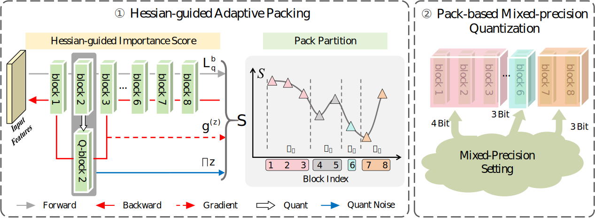

# Pack-PTQ: Advancing Post-training Quantization of Neural Networks by Pack-wise Reconstruction

A PyTorch implementation of Pack-PTQ, an advanced post-training quantization method that uses pack-wise reconstruction to efficiently quantize vision models while maintaining high accuracy.

## Overview

<div align=center>
  
</div>


Pack-PTQ addresses the challenge of neural network quantization by:
- **Adaptive Block Packing**: Groups layers into optimized packs for joint reconstruction
- **Pack-wise Reconstruction**: Reconstructs quantization parameters at the pack level rather than layer-by-layer
- **Mixed Precision Support**: Automatically determines optimal bit-widths for different layers

## Supported Models

| Architecture | Models |
|--------------|--------|
| **ViTs** | ViT (small, base), DeiT (tiny, small, base), Swin (tiny, small, base) |
| **CNNs** | ResNet (18, 50), MobileNetV2, RegNet (600M, 3200M), MNASNet |

## Installation

```bash
git clone <repository-url>
cd Pack_PTQ
pip install -r requirements.txt
```

**Requirements**: Python 3.8+, PyTorch 1.9+, timm 0.4.12+

## Quick Start

### Basic Usage

```bash
python main.py --dataset_path /path/to/imagenet --model_name resnet18 --weight_bits 3 --activation_bits 3
```

### With Mixed Precision

```bash
python main.py --dataset_path /path/to/imagenet --model_name deit_tiny --weight_bits 3 --activation_bits 3 --enable_mixed_precision
```

## Key Parameters

| Parameter | Description | Default |
|-----------|-------------|---------|
| `--weight_bits` | Weight quantization bits | 3 |
| `--activation_bits` | Activation quantization bits | 3 |
| `--enable_mixed_precision` | Enable mixed precision | False |
| `--calibration_samples` | Calibration dataset size | 1024 |
| `--calibration_iterations` | Optimization iterations | 20000 |
| `--learning_rate` | Learning rate for reconstruction | 4e-5 |
| `--temperature_start/end` | Temperature annealing range | 20/2 |

## Output Structure

```
Pack_PTQ/
├── trained_models/          # Final quantized models
├── inited_models/           # Initialized models (before training)
└── *.log                    # Timestamped experiment logs
```

### Model Files
- **Format**: `{timestamp}_{model}_{weight_bits}_{activation_bits}.pt`
- **Contents**: Model state dict, quantization parameters, accuracy metrics

## Architecture

```
Pack_PTQ/
├── main.py                # Main execution script
├── utils/                 # Utilities and configuration
│   ├── parser.py          # Argument parsing
│   ├── config.py          # Configuration management
│   ├── dataset.py         # Data loading
│   ├── initialize.py      # Model initialization
│   └── accuracy.py        # Evaluation metrics
├── quant/                 # Quantization implementation
│   ├── quant_model.py     # Quantized model definitions
│   ├── quant_module.py    # Quantized layer modules
│   ├── blocks_packing.py  # Adaptive block packing
│   ├── mixed_precision.py # Mixed precision logic
│   └── reconstruction.py  # Pack-wise reconstruction
└── models/                # Model architectures
```

## License

This project is licensed under the MIT License.